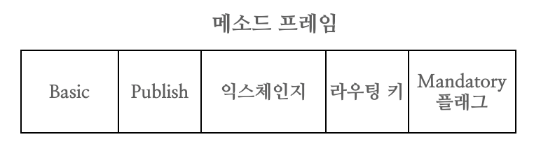

# Frame
RabbitMQ 에서 AMQP 명령을 전송하거나 수신할 때 필요 모든 인자들은 데이터 구조로 캡슐화된 프레임으로 인코딩돼 전송된다. 
프레임은 명령과 해당 인자를 인코딩해 각 프레임이 서로 구분되도록 하는 효율적인 방법이다. 
프레임은 서로 동일한 기본 구조로 구성되어 있으며 내용만 서로 다르다.

저수준 AMQP 프레임은 다섯 개의 개별 구성 요소로 구성된다.

1. 프레임 유형
2. 채널 번호
3. 프레임 크기(바이트)
4. 프레임 페이로드(내용)
5. 끝 바이트 표식

저수준 AMQP 프레임은 세 개의 필드로 구성된 프레임 헤더로 시작한다.
첫 번째 필드는 프레임 유형을 나타내는 단일 바이트고, 
두번째 필드는 프레임이 속하는 채널을 지정한다.
세 번째 필드는 프레임 본문의 크기를 바이트로 표현한다.
프레임 구조의 마지막에는 프레임의 끝을 나타내는 바이트 마커가 있다. 
프레임 내부 헤더와 마지막 바이트 마커 사이에는 페이로드가 있다. 열차에서 내용물을 보호하는 열차 칸과 마찬가지로 프레임은 운반하는 내용을 무결성 있게 보호하도록 설계되어 있다.

## 프레임의 유형
AMQP 스펙에는 프로토콜 헤더 프레임, 메소드 프레임, 콘텐츠 헤더 프레임, 바디 프레임, 하트비트 프레임 등 다섯 가지 유형의 프레임이 정의돼 있다. 
각 프레임 유형은 각각 고유한 목적을 가지고 있으며 일부는 다른 프레임에 비해 훨씬 자주 사용된다.

프레임 유형 | 사용
------------|------
프로토콜 헤더 프레임 | RabbitMQ에 연결할 때 한번만 사용된다.
메소드 프레임 | RabbitMQ와 서로 주고받는 RPC 요청이나 응답을 전달한다.
콘텐츠 헤더 프레임 | 메시지의 크기와 속성을 포함한다.
바디 프레임 | 메시지의 내용을 포함한다.
하트비트 프레임 | RabbitMQ와 연결된 클라이언트와 서버가 주고받으며 서로 사용가능한 상태인지 확인하는 데 사용한다.

## 메시지를 프레임으로 마샬링 하기
RabbitMQ에 메시지를 발행할 때 메소드 프레임, 헤더 프레임, 바디 프레임이 사용된다.
첫 번째 전송되는 프레임은 명령을 전달하는 메소드 프레임이며, 실행하는 데 필요한 매개변수인 익스체인지(Exchange)와 라우팅 키(Routing key)를 함께 전송한다. 
메소드 프레임 다음에는 콘텐츠에 해당되는 프레임들이 이어지는데, 이는 콘텐츠 헤더 프레임과 바디 프레임이다. 
콘텐츠 헤더 프레임에는 본문 크기와 함께 메시지 속성이 포함돼 있다.
AMQP에는 최대 프레임 크기가 있으며, 메시지 본문이 이 크기를 초과하면 콘텐츠가 여러 바디 프레임으로 분할된다. 항상 동일한 순서인 메소드 프레임, 콘텐츠 헤더 프레임 그리고 하나 이상의 바디 프레임 순으로 전송된다.

RabbitMQ에 메시지를 보낼 때 메소드 프레임에 Basic.Publish 명령이 전송된다음,
다음 메시지의 내용 유형 및 메시지가 전송된 시간 등의 메시지 속성이 포함된 콘텐츠 헤더 프레임이 이어진다. 이 속성은 AMQP 스펙에 정의된 Basic.Properties 데이터 구조로 캡슐화 된다.
마지막으로 메시지의 내용이 적절한 수의 바디프레임으로 마샬링 된다.

데이터의 크기를 최소화 하기위해 메소드 프레임과 콘텐츠 헤더 프레임의 내용은 이진데이터로 구성돼 있으므로 사람은 읽을 수 없다.
메소드 프레임 및 콘텐츠 헤더 프레임과 달리 바디 프레임 내부의 전달되는 메시지 내용은 어떤 방식으로도 압축거나 인코딩 돼 있지 않으며 일반 텐스트에서 이진 이미지 데이터에 이르기까지 다양한 형태가 저장될 수 있다.

## 메소드 프레임 해부하기

메소드 프레임은 RPC 요청이 처리할 클래스와 메소드 그리고 실행을 위한 인수를 함께 전달한다.
Basic.Publish 명령을 전달하는 메소드 프레임에는 명령을 설명하는 바이너리 데이터와 함께 전달되는 요청인자가 들어있다.
처음 두 필드는 숫자로 표현된 Basic 클래스와 Publish 메소드다. 이는 RPC 명령을 표현하는 필드로 숫자값으로 전달된다.
이어서 익스체인지의 이름과 라우팅 키가 문자열로 저장된다. 앞에서 언급했듯이, 이 두 속성은 RabbitMQ 서버에게 메시지의 경로 지정방법을 전달한다.
라우팅 키는 적절한 큐로 라우팅하기 위한 정보로 익스체인지에 제공된다.
마지막으로 Mandatory 플래그는 RabbitMQ에게 메시지가 정상적으로 전달됐는지 혹은 실패했는지를 알려준다. 적절하게 라우팅 할 수 없다면 Basic.Return 프레임을 반환한다.

## 콘텐츠 헤더 프레임 해부하기

콘텐츠 헤더 프레임은 RabbitMQ에 메시지의 크기와 그 외 데이터를 전달한다. 이는 RabbitMQ 서버와 메시지를 수신하는 애플리케이션 사이에 주고받는 메시지를 설명하는 속성을 포함한다. 이러한 속성은 Basic.Properties 테이블의 값으로 메시지 내용을 설명하는 데이터가 포함돼 있거나 비어있을 수 있다. 

## 바디 프레임 해부하기
메시지의 데이터는 메시지 속성과 본문으로 구분돼 저장된다. 
