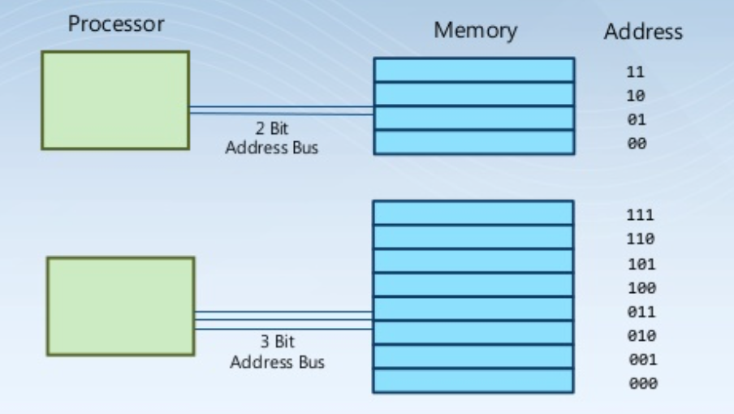

# 주소 지정
## 메모리 위치 및 메모리 주소
모든 메모리 위치는 주소를 가져야 한다. 일반적으로 각각의 메모리 위치는 8bit의 데이터를 저장한다. 각각의 주소는 특정 메모리 위치에 대한 고유 식별자이다.

## 주소 지정(addressability)
컴퓨터가 메모리 위치를 식별하는 방식을 '주소 지정'이라 한다.

## 메모리 위치
### 메모리 위치와 주소버스
주소 버스의 폭(width)이 주소 지정할 수 있는 메모리 위치의 최대 크기(갯수)를 결정한다. 1bit의 주소버스는 2개의 메모리 위치에 접근 할 수 있다.

### 버스(bus)
버스는 컴퓨터 용어로 컴퓨터의 내부나 외부의 각 장치와의 정보나 신호를 주고받는 데 사용되도록 구성된 전기적 통로를 말한다.
'주소 버스'는 주소값을 주고 받을 수 있는 '신호 통로'를 의미하며, 1bit 주소버스로는 1bit의 주소값을 주고 받을 수 있다.

## N bit 주소 버스
### 주소 버스 크기와 주소 지정
컴퓨터가 사용할 수 있는 '주소 지정' 가능한 범위는 '주소 버스'의 크기에 좌우된다. 2bit 주소버스는 4개, 3bit는 8개의 주소를 지정할 수 있다. 
일반적으로 32bit 컴퓨터라는 의미는 32bit 주소 버스를 가진 (혹은 그런 구조로 설계된) 컴퓨터 이다. 또한 64bit컴퓨터라고 해서 물리적으로 64bit address bus를 사용하는 것은아니다. 논리적 개념으로 이해해야한다. 

