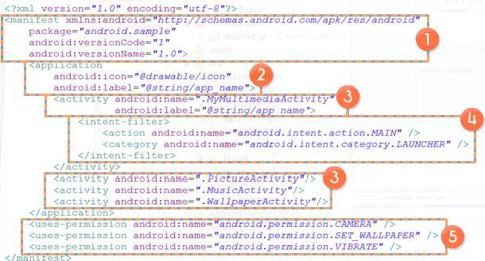

# 안드로이드 Manifest 파일
안드로이드 어플리케이션에 대한 각종 정보를 기술한 어플리케이션 명세서로 AndroidManifest.xml라는 파일명을 갖는다.

## 안드로이드 매니페스트 파일이란?
어플리케이션에 대한 필수적인 정보를 안드로이드 플랫폼에 알려준다. 모든 안드로이드 어플리케이션은 반드시 AndroidManifest.xml 파일을 자신의 루트 디렉토리에 가지고 있어야 한다.

## AndroidManifest.xml 에 기술되는 내용
    1) 안드로이드 어플리케이션을 위한 자바 패키지명 정의
        : 이 패키지명은 전체 시스템 상으로 유일해야한다.
    2) 안드로이드 어플리케이션을 구성하는 컴포넌트들(Activity, Service, Broadcast Receiver, Content Provider)을 기술해야 한다.
    3) 어플리케이션을 구성하는 컴포넌트들에 대한 해당 클래스명을 정의하고, 그 컴포넌트가 처리할 수 있는 기능이 무엇인지 Intent-filter를 정의
        : 이를 통해 한 안드로이드 어플리케이션 안에 어떤 컴포넌트들 존재하며, 어떤 조건에 해당 컴포넌트가 시작돼야 하는지 안드로이드 플랫폼이 알 수 있다.
    4) 안드로이드 어플리케이션이 안드로이드 플랫폼의 제한된 API에 접근하거나 다른 어플리케이션의 제한된 컴포넌트를 사용하기 위해서 필요한 권한을 설정
        : 안드로이드 어플리케이션은 자신의 Component를 쉽게 사용할 수 없도록 권한을 설정할 수 있다.
    5) 안드로이드 어플리케이션 개발이나 테스트 단계에서 어플리케이션의 동작을 로깅하거나 모니터링하기 위한 instrumentation 클래스를 설정
        : 개발 및 테스트가 끝나고 실제 배포시 이를 삭제해야 한다.
    6) 안드로이드 어플리케이션을 구동하기 위한 최소한의 SDK 버전을 정의
    7) 안드로이드 어플리케이션이 사용하는 다른 추가적인 라이브러리들을 정의

## AndroidManifest.xml
기본적으로 AndroidManifest.xml은 루트요소가 <manifest>이고, 그 자식으로 <application> 요소가 하나 존재한다.


### ① <manifest>
안드로이드 어플리케이션의 패키지명과 버전정보(버전 이름과 버전 코드 등)를 정의한다. 여기서는 안드로이느 어플리케이션을 구성하는 자바 클래스들의 패키지명이 android.smaple로 시작한다. 
버전 이름은 1.0 버전 코드는 1이다.

### ② <application>
어플리케이션의 제목과 아이콘을 정의하고, <manifest> 밑에는 하나의 <application>만 정의된다. 여기서는 안드로이드 어플리케이션 제목이 string 리소스에 있는 app_name 문자열 값으로 설정되어있다.

### ③ <activity>
안드로이드 어플리케이션을 구성하는 네가지 컴포넌트들 중에 Activity를 정의하는 Activity 클래스 명과 Activity의 이름을 정의할 수 있다. 여기서는 네 가지 Activity인 MyMultimediaActivity, PictureActivity, MusicActivity, WallpaperActivity가 해당 안드로이드 어플리케이션에 존재하는 것을 알 수 있다.

### ④ <intent-filter>
해당 Component의 intent-filter를 가리키는 것으로, 해당 Component(Activity,Service,Broadcast Receiver 등)가 어떤 암시적 Intent를 처리할 수 있는지 정의. 
<intent-filter>는 그 밑으로 <action> 요소를 정의하여 어떤 작업을 처리할 수 있는지 정의할 수 있다. 
<category> 요소를 정의하여 Component의 유형이 무엇인지 정의할 수 있다.
여기에 설정된 intent-filter는 해당 Activity가 안드로이드 어플리케이션이 실행될 때 처음 시작되는 main Activity임을 정의하고 있다.

### ⑤ <uses-permission>
안드로이드 어플리케이션의 리소스 접근 및 기능 사용 권한을 정의한다. 여기서는 해당 어플리케이션이 카메라와 바탕화면 배경 그림 설정, 진동 기능을 사용할 수 있도록 권한을 설정하였다.

## AndroidManifest.xml 의 구성
### <manifest>에 정의될 수 있는 주요 속성
    * pacakage : 안드로이드 어플리케이션의 자바 패키지명을 설정
    * android:versionCode : 안드로이드 어플리케이션의 버전 코드를 설정
    * android:versionName : 안드로이드 어플리케이션의 버전 이름을 설정

### <manifest> 밑으로 정의될 수 있는 주요 XML 요소
XML 요소 | 설명
--------|---------
<application> | - 안드로이드 어플리케이션을 구성하는 Component 정보를 포함해서 어플리케이션에 대한 각종 정보를 정의한다. 
<uses-permission> | - 안드로이드 어플리케이션의 리소스 접근 및 기능 사용 권한을 정의한다. \n - 기본적으로 안드로이드 어플리케이션에는 어떠한 권한도 부여되지 않기 때문에, 안드로이드 어플리케이션이 특정 내장 리소스에 접근하거나 특정 내장 기능을 사용하려 한다면 정상적으로 작동하기 위해서 필요한 권한을 AndroidManifest.xml에 명시해야만 한다. \n - 이와 같이 명시된 권한들은 해당 안드로이드 어플리케이션이 모바일 기기에 설치될 때 부여된다.
<uses-sdk> | - 안드로이드 어플리케이션이 필요로 하는 최소 SDK 버전을 지정
<permission> | - 안드로이드 어플리케이션이 제공하는 데이터나 기능 등에 대한 사용을 제한하는 자신만의 권한을 등록하여, 다른 어플리케이션들이 해당 어플리케이션의 데이터나 기능 등을 이용할 때 설정해야만 하는 권한 
<instrumentation> | - 안드로이드 어플리케이션이 동작하는 중요한 내용을 측정, 검사하기 위한 Instrumentation의 서브 클래스를 정의 
<uses-configuration> | - 사용자 입력에 관한 모바일 기기의 하드웨어, 소프트웨어에 대한 특정 요구사항을 정의 
<uses-feature> | - 안드로이드 어플리케이션이 필요로 하는 모바일 기기의 하드웨어나 소프트웨어 기능을 지정 

### <application>에 정의될 수 있는 주요 속성
어플리케이션의 핵심 정보 정의하는 부분이다. 안드로이드 어플리케이션을 구성하는 Component들에 대한 정보 기술

    * android:icon : 화면에 표시될 안드로이드 어플리케이션의 아이콘 이미지를 설정하는 부분이다. 안드로이드 어플리케이션에 포함된 모든 Component에 기본 아이콘 이미지로 설정된다.
    * android:label : 화면에 표시될 안드로이드 어플리케이션의 제목을 설정이다. 이 안드로이드 어플리케이션에 포함된 모든 Component에 기본 제목으로 설정된다.
#### <activity>
Activity Component를 정의
    * android:name : 속성을 통해 Activity 클래스명을 설정할 수 있다.
    * android:icon와 android:label 속성을 재정의하여 해당 Activity만의 아이콘 이미지와 제목을 설정할 수 있다.

XML 요소 | 설명
--------|---------
<intent-filter> | - Activity가 처리할 수 있는 암시적 Intent를 설정하여 언제 Activity가 시작될지 설정할 수 있다. \n - 그 밑으로 <action> 요소를 정의하여 어떤 작업을 처리할 수 있는지 정의할 수 있다. \n - <category> 요소를 정의하여 Component의 유형이 무엇인지 정의할 수 있다. 
<meta-data> | - Activity가 사용할 수 있게 추가적인 데이터를 설정할 수 있다. 

일반적으로, 아래 코드와 같이 Intent-filter를 설정하면, 해당 Activity를 해당 어플리케이션이 실행되는 진입점으로 설정할 수 있다.

``` xml
<intent-filter>
    <action android:name: "android.intent.action.MAIN" />
    <category    android:name: "android.intent.category.LAUNCHER" />
</intent-filter>
```

#### <service>
서비스 컴포넌트를 정의
    * android:name : 속성을 통해 서비스 클래스명을 설정
    * android:icon와 android:label 속성을 재정의하여 해당 서비스만의 아이콘 이미지와 제목을 설정할 수 있다.
<service> 밑으로 <activity>와 마찬가지로 <intent-filter>와 <meta-data> 요소를 정의할 수 있다.

#### <receiver>
Boradcast Receiver Component를 정의
    * android:name 속성을 통해 Broadcast Receiver 클래스명을 설정할 수 있다.
    * android:icon와 android:label 속성을 재정의하여 해당 Broadcast Receiver만의 아이콘 이미지와 제목을 설정할 수 있다.
<receiver> 밑으로 <activity>와 마찬가지로 <intent-filter>와 <meta-data> 요소를 정의할 수 있다.

#### <provider>
Content Provider Component를 정의
    * android:name 속성을 통해 Content Provider 클래스명을 설정할 수 있다.
    * android:icon 과 android:label 속성을 재정의하여 해당 Content Provider만의 아이콘 이미지와 제목을 설정할 수 있다.
<provider> 밑으로는 <grant-uri-permissions>와 <meta-data> 요소를 정의할 수 있다.

XML 요소 | 설명
--------|---------
<meta-data> | - 다른 컴포넌트에서 정의하는 것처럼 Content Provider가 사용할 수 있게 추가적인 데이터를 설정할 수 있다. 
<grant-uri-permissions> | - Content Provider가 URI 수준으로 권한을 세밀하게 설정할 때 사용될 수 있다. \n -<provider>의 android:grantUriPermissions 속성 값이 true이면 해당 Content Provider안의 어떤 데이터에 대해서도 접근 권한이 부여된다. \n - 만약 속성 값이 false라면 이 <grant-uri-permissions>에 의해 설정된 데이터 URI에 한해서만 접근 권한이 부여된다. 

#### <uses-library>
이와 같이 컴포넌트 외에도 <application>에는 <uses-library>를 자식 XML 요소로 정의할 수 있는데, <uses-library>는 안드로이드 어플리케이션이 다른 추가적인 라이브러리를 사용할 때 해당 패키지를 정의할 때 사용된다.


