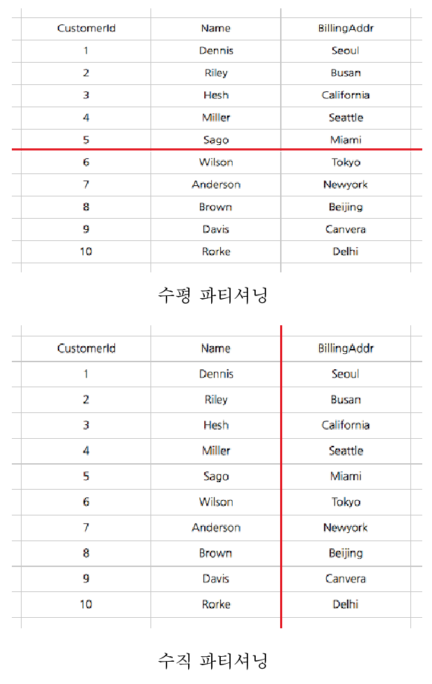

# Sharding (샤딩)

#### 샤딩이란?
	* 샤딩이란 대량의 데이터를 처리하기 위해 여러 개의 데이터베이스에 데이터를 분할하는 기술이다.
 	* 각각 분할된 데이터 베이스는 샤드(shard) 혹은 데이터베이스 샤드(sdatabase shard) 라고 부르며, 부하 분산을 위해 서로다른 데이터베이스 서버에 저장된다. 즉 샤딩은 DBMS에서 데이터를 나누는 것이 아니고 데이터베이스 자체를 분할하는 방식이다.
	* Shard의 사전적 뜻:  a small part of a whole, 즉 '조각' 이라는 뜻이다.

#### 파티셔닝과 샤딩
데이터베이스 파티셔닝이란 성능과 이용 및 관리의 편의성을 위해 데이터를 서로 다른 테이블 혹은 데이터베이스로 분산하는 것을 의미한다. 파티셔닝에는 수직분할(vertical partitioning)과 수평분할(horizontal partitioning)이 있다.

	* 수직분할: 하나의 데이터를 스키마* 기준으로 나눠 여러테이블(혹은 데이터베이스) 에 저장하는 방식.
		예) id, name, address로 구성된 고객 정보를 id를 참조하도록 하여 name과 address 테이블로 나누어 저장할 수 있다.

	* 수평분할: 스키마가 같은 데이터를 여러 테이블에 나누어 저장하는 방식. 여러 데이터베이스를 대상으로 작업해야 하기 때문에 경우에 따라서는 기능에 제약이 있을 수 있고(JOIN 연산 등) 일관성(consistency)과 복제(replication) 등에서 불리한 점이 많다.
		예) 고객정보를 id에 따라 0 ~ 10000 까지는 테이블 A에, 10001 ~ 20000번 까지는 테이블 B에 저장하는 것.

보통 수평 분할을 한다고 했을 때는 하나의 데이터베이스 안에서 이루어지는 경우를 지칭한다. 샤딩은 물리적으로 다른 데이터베이스에 데이터를 수평분할 방식으로 분산 저장하는 방법을 말한다.

* 파티셔닝은 퍼포먼스, 가용성, 정비용이성등의 목적을 위해 논리적인 엔티티들을 다른 물리적인 엔티티들로 나누는것을 의미하는 일반적인 용어이다. 수평 파티셔닝 또는 샤딩은 스키마 복제 후 샤드키를 기준으로 데이터를 나누는것을 말한다. 수직 파티셔닝은 스키마를 나누고 데이터가 따라 옮겨가는것을 말한다

		* 데이터베이스 스키마(database schema)란?
		데이터 베이스에서 자료의 구조, 자료의 표현방법, 자료 간의 형식언어로 정의한 구조이다. DBMS은 주어진 설정에 따라 데이터베이스 스키마를 생성하며, 데이터베이스 사용자가 자료를 저장, 조회, 삭제, 변경할 때 DBMS는 자신이 생성한 데이터베이스 스키마를 참조하여 명령을 수행한다.
	
