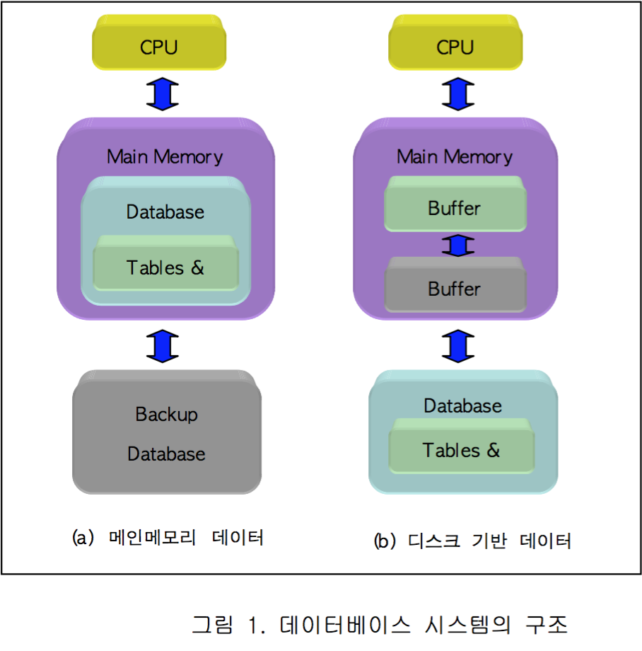

# In-Memory Database(인 메모리 데이터베이스)

* 디스크가 아닌 주 메모리에 모든 데이터를 보유하고 있는 데이터 베이스.
* 디스크 검색보다 자료접근이 훨씬 빠른 것이 가장 큰 장점이다.
* 데이터 양의 빠른 증가로 데이터 베이스 응답 속도가 떨어지는 문제를 해결할 수 있는 대안이 인메모리 데이터베이스다. 
* 전형적인 디스크 방식은 디크스에 저장된 데이터를 대상으로 쿼리를 수행하지만, 인 메모리 방식은 메모리상에 색인을 넣어 필요한 모든 정보를 메모리상의 색인을 통해 빠르게 검색할 수 있다.
* 물론 DBMS의 속성 중 하나인 Durability(지속성/비휘발성)를 보장하기 위하여 메모리에 INSERT/UPDATE/DELETE 된 값들은 모두 디스크에 로그로 기록하며, DBMS가 재구동될 때 디스크로부터 로그 파일을 읽어와 메모리에 DBMS 구조를 모두 재구축한다.
* 현재 메인메모리 데이터베이스(MMDB), 주기억장치 상주 데이터베이스(MRDB), 또는 인-메모리 데이터베이스(IMDB) 등의 이름으로 불리는 데 이는 데이터베이스를 메모리에 저장한다는 동일한 개념을 내포한 이름이다.

* 인메모리에 상주한 데이터 객체들은 디스크에 저장된 객체에 대한 임시 저장소의 역할을 하는 것이 아닌 주저장소로서의 역할을 하게 된다.

	* 데이터를 메인메모리에서 관리하는 최대 이점
		1) 디스크 접근을 최소화 하는데 있다. 
		2) 데이터가 디스크에 존재한다는 가정이 사라지므로 메모리 구조에 효율적인 질의 처리를 통해 높은 트랜잭션 처리율을 보일 수 있다.

## 디스크 기반 데이터 베이스
* 저장 장치로서의 디스크는 메인 메모리에 비해 저장된 데이터의 지속성이 뛰 어난데 비해 상대적으로 접근 속도가 느리다. 따라서 대부분의 기존 데이터 베이스 시스템은 메모리에 임시 저장소(버퍼)를 마련하고 데이터를 이중적으로 관리한다.

* 접근 속도를 높이기 위해, 메모리에서 버퍼를 관리 하는 버퍼 관리자를 통해 데이터에 접근 한다. 버퍼 관리자는 한정된 버퍼를 효율적으로 활용하기 위한 다양한 교체(replacement) 알고리즘을 구현하고 있는데, 이러한 구조는 데이터 접근 및 질의 처리에 있어서 알고리즘의 복잡도를 증가시키는 한계를 갖는다.

## 디스크 기반 데이터베이스와 메모리 데이터베이스의 차이

