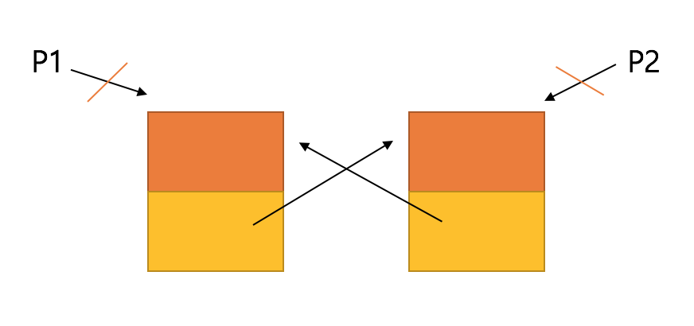

# Reference Counting (객체의 수명을 관리하는 기술)
Reference Counting이란 객체의 메모리를 참조하는 계수를 기반으로 판단하는 방법입니다.
객체의 수명을 관리하는 기술에는 두가지가 있습니다.
	1) ARC (Auto Reference Counting) : ObjectC / Swift 
	2) GC (Garbage Collection) : Java / C#

1) ARC (Auto Reference Counting)
	컴파일러가 컴파일 타임에 코드를 분석해서 참조계수를 조작하는 코드를 삽입하는 방식입니다.
	컴파일러가 오판할 시에 오류가 발생할 가능성이 있습니다. 컴파일 타임에 결정됨으로 GC와 비교시 좀 빠르지만 인지될 정도는 아닙니다.
``` objc
#import <Foundation/Foundation.h>


// .h
@interface Image : NSObject

- (id)init;
- (void)dealloc;
@end

// .m
@implementation Image

- (id)init {
	self = [super init];
	if (self) {
		NSLog(@"객체 생성");
	}

	return self;
}

- (void)dealloc {
	NSLog(@"객체 파괴");

	[super dealloc];
}
@end


int main()
{
	//  1. 객체가 처음 생성되면 ref counting 1 입니다.
	// Image p1 = new Image();
	Image* p1 = [Image new];
	NSLog(@"ref count: %ld", [p1 retainCount]);

	// 2. 객체의 포인터를 대입하면 참조 계수를 증가해야 합니다.
	Image* p2 = p1;
	[p2 retain]; // 참조 계수를 증가시켜주는 함수
	NSLog(@"ref count: %ld", [p1 retainCount]);

	// 3. 더 이상 사용하지 않는다면, 참조 계수를 감소해야 합니다.
	[p1 release]; // 참조계수를 감소시키는 함수
	[p2 release];

	NSLog(@"프로그램 종료");
}

```
ObjectC에서 Auto Reference Counting을 사용하게 되면 실제 위와 같은 코드(retain/ release]가 생성됩니다.
위 코드는 ARC기능사용을 해제하고 구현한 코드입니다. 자동기능을 끄고 코드를 작성할 때는 레퍼런스 카운팅에 관련한 코드를 위와같이 직접 작성해야 합니다.

``` objc
#import <Foundation/Foundation.h>

@interface Node : NSObject
@property(weak) Node* next;  // 혹은 @property(strong) Node* next;
// weak: auto niling => 참조하는 객체가 파괴되면, 자동으로 next를 nil로 바꿔준다. / 약한 참조
// strong: 단순 참조만을하고 있을때도 레퍼런스 카운트가 감소되지 않는다./ 강한 참조
@end

@implementation Node
- (void)dealloc {
NSLog(@"Node 파괴");
}
@end

// 참조 계수 기반의 객체 수명 관리에서는 순환 참조에 의한 메모리 누수가 발생한다.
// 참조 계수를 무작정 증가시키는 것은 위험하다.
//  => 소유권
//     '있다' => 강한 참조 (생성 책임, 소멸 책임)
//     '없다' => 약한 참조 (참조만을 목적으로 한다)
void foo()
{
	Node* p1 = [Node new];
	Node* p2 = [Node new];

	for (int i = 0 ; i< 10000 ; ++i) {
		p1.next = p2;
		p2.next = p1;
	}
}


int main()
{
	NSDate* p = [NSDate date];
	foo();
	NSLog(@"Time: %lf", -[p timeIntervalSinceNow]);

}
```

2) GC (Garbage Collection)
	실행시간에 가비지 컬렉터가 주기적으로 Reference Count가 0인 객체를 수거하는 방식입니다. 
	ARC보다 정확성은 높습니다만 GC에 의해 수거되는 시점을 알 수 없습니다.

	예) 자바에서는 HashMap - WeakHashMap으로 메모리 누수를 방지할 수 있습니다. 

### 약한참조
	약한 참조에는 두가지가 있습니다.
	1) Weak Reference : Reference Count가 0이 될때 수거 됩니다.
	2) Soft Reference : Out Of Memory가 발생했을 때 수거됩니다. 

### 순환참조
	
	실제로 레퍼런스 참조(P1 ,P2)가 끊어졌음에도 연결리스트에서 서로를 참조하고있으면 실제의 레퍼런스 카운트는 감소되지 못하고 가비지 컬렉터에의헤 수거되지 못하여 메모리 누수가 발생함.
