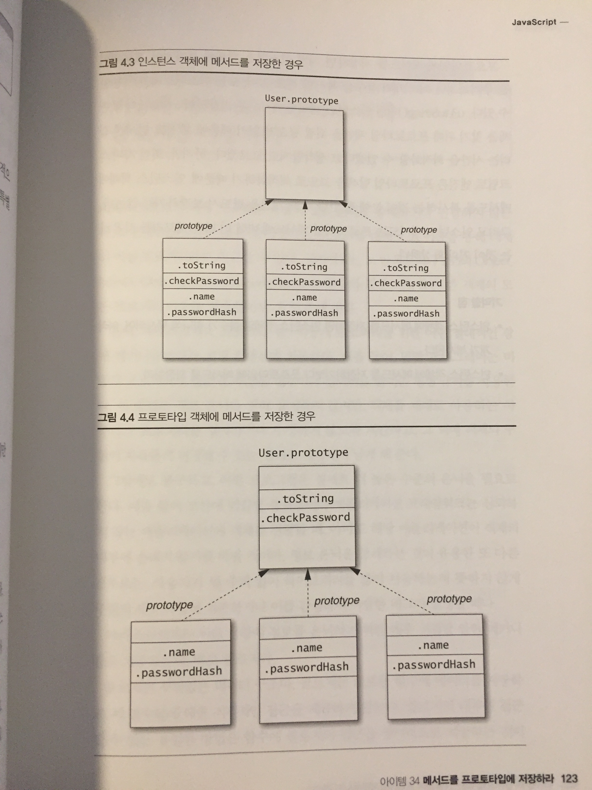

# 메서드를 프로토타입에 저장하라
자바스크립트에서 프로토타입을 쓰지 않고도 프로그램을 작성하는 것이 가능합니다
프로토타입에 어떠한 것도 정의하지 않고 다음과 같이 구현 할 수도 있습니다.

``` javascript
function User(name, passwordHash){
	this.name = name;
	this.passwordHash = passwordHash;
	this.toString = function(){
		return '[User ' + this.name + ']';	
	}
	this.passwordHash = function(passwordHash){
		return hash(password) === this.passwordHash;
	}
}

```

대부분의 경우 프로토타입에 메소드를 추가한것과 그렇지 않은것은 원래의 구현과 똑같은 방식을 동작합니다.
하지만 프로토타입에 메서드를 추가하지 않은 클래스의 인스턴스를 여러개를 생성한다면 중요한 차이점이 생깁니다.

``` javascript
var u1 = new Users();
var u2 = new Users();
var u3 = new Users();
```

)


그림 4.3은 이 세 객체와 그 프로토타입 객체가 어떻게 생겼는지를 보여줍니다.
toString()과 checkPassword 메서드를 프로토타입으로 공유하지 않고 각 인스턴스는 두 메서드 모두를 복사하여 저장하므로, 통틀어 여섯개의 함수객체가 저장됩니다.

이와 대조적으로, 그림 4.4는 원본의 정의를 사용했을때의 세 객체와 그 프로토타입의 모습을 보여줍니다.
toString() 과 checkPassword 메서드는 한 번 생성되고 프로토타입을 통해 모든 인스턴스에 공유됩니다.

프로토타입에 메서드를 저장하면 개별 인스턴스 객체에 부가적인 프로퍼티를 추가하거나 여러개의 함수를 복사할 필요없이,
모든 인스턴스에서 사용할 수 있습니다.

또한 u3.toString() 처럼 인스턴스 객체에 메서드를 저장하면 toString의 구현체를 찾기위해 프로토타입 체인을 뒤질 필요가 없기때문에, 메서드 탐색에 걸리는 시간을 최적화할 수 있겠다고 생각할지도 모르겠다. 
하지만 최신 자바스크립트 엔진은 프로토타입탐색을 고도로 최적화하기 때문에, 인스턴스 객체에 메서드를 복사하는 것이 눈에 띌만한 속도 개선을 보장하지는 않는다.
또한 인스턴스 메서드는 프로토타입 메서드에 비해 더 많은 메모리를 사용한다.

### 정리
* 인스턴스 객체에 메서드를 저장하면 인스턴스 객체당 함수가 하나씩 복사되어, 여러개가 복사된다.
* 인스턴스 객체에 메서드를 저장하기보다 프로토타입에 메서드를 저장하라.


