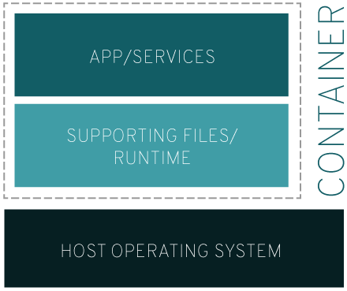
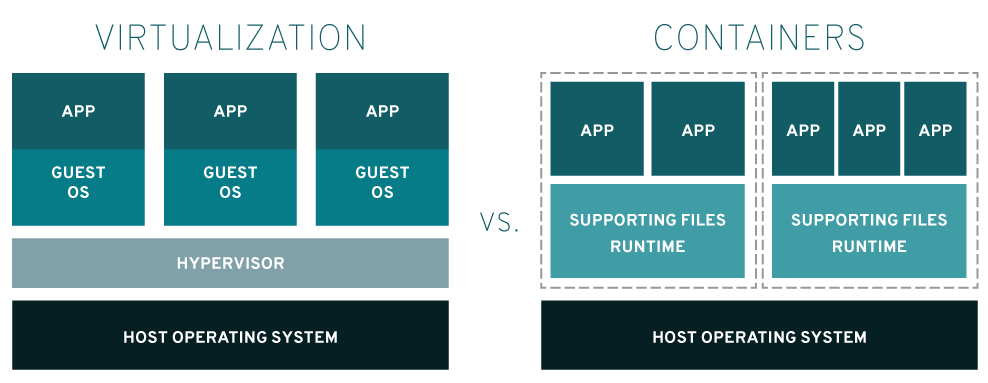

# Linux Container
Linux® 컨테이너는 다른 시스템과 분리되는 프로세스 세트를 말하는 것으로, 고유한 이미지에서 실행되어 프로세스를 지원하는 데 필요한 모든 파일을 제공합니다. 이는 애플리케이션의 종속성이 모두 포함된 이미지를 제공하며 개발, 테스트, 생산에 이르는 모든 과정을 진행하는 동안 이식성과 일관성이 유지됩니다.

더 자세히 설명하기 위해, 여러분이 애플리케이션을 개발하고 있다고 가정해 봅시다. 여러분이 사용하는 노트북의 환경은 특정한 설정을 가지고 있으며 다른 개발자들의 설정은 약간 다를 수 있습니다. 이러한 설정에 따라 그리고 특정 파일에 따라, 어떤 애플리케이션이 개발될지가 정해집니다.
한편, 기업의 테스트 및 운영환경은 자체적인 설정과 지원 파일 세트를 통해 표준화되어 있습니다. 개발자들은 가능한 한 로컬에서 이러한 환경을 에뮬레이션하려 하며, 서버 환경을 재구축하는 데 드는 오버헤드는 피해야 합니다. 
그렇다면, 앱이 모든 환경에서 작동하고 품질 보증을 통과하도록 하며 큰 문제나 재작성, 오류 해결 과정 없이 앱을 배포하려면 어떻게 해야 할까요? 그 대답은 바로 __'컨테이너'__ 입니다.
애플리케이션 컨테이너에는 필요한 설정과 파일이 포함되므로 개발, 테스트, 생산에 이르는 모든 과정을 진행하는동안 큰 문제가 발생하지 않습니다. 위기가 방지되고, 모든 사람이 만족할 수 있게 되는 겁니다.

이는 간단한 한 예에 불과하며, Linux 컨테이너는 이식성, 설정 가능성, 격리성이 높은 수준으로 유지되어야 하는 곳에 다양한 방식으로 적용할 수 있습니다. 온프레미스, 클라우드, 하이브리드 중 인프라가 어떤 방식을 취하든, 컨테이너는 요구 사항을 충족해 줍니다.

## 그저 가상화일 뿐이라고요?
그럴 수도 있고, 아닐 수도 있습니다. 두 개념을 간단하게 비교해 볼까요?

* 가상화는 단일 시스템에서 여러 운영체제가 동시에 실행될 수 있도록 합니다.
* 컨테이너는 동일한 운영체제 커널을 공유하면서 다른 시스템으로부터 애플리케이션 프로세스를 나머지 격리해줍니다.

이것이 무슨 의미일까요? 개발 초기에는 하이퍼바이저에서 여러 운영 체제를 실행하고 소프트웨어를 통해 가상화를 구현하려면 컨테이너보다 많은 용량이 필요합니다. 리소스가 한정되어 있고 기능이 제한적인 경우에는 높은 밀집도로 배포할 수 있는 가벼운 앱이 필요합니다.
Linux 컨테이너는 이러한 단일 운영 체제에서 실행되고 모든 컨테이너 전반에서 운영 체제를 공유하므로 앱과 서비스가 경량으로 유지되며 신속한 동시 실행이 구현됩니다.

## 컨테이너의 간략한 역사
우리가 현재 '컨테이너 기술'이라 부르고 있는 개념은 2000년에 [FreeBSD Jail](https://www.freebsd.org/doc/handbook/jails.html)로 처음 등장했습니다. 이는 FreeBSD 시스템을 여러 하위 시스템 또는 Jail로 파티셔닝하는 기술입니다. Jail은 시스템 관리자가 조직 내부 또는 외부의 여러 사용자와 공유할 수 있는 안전한 환경으로 개발되었습니다.
Jail 환경의 목적은 파일 시스템, 네트워킹 및 사용자에 대한 액세스가 가상화되고 전체 시스템을 이스케이프하거나 손상시킬 수 없는, 수정된 [chrooted](https://en.wikipedia.org/wiki/Chroot) 환경에서 프로세스를 구축하는 것이었습니다. Jail은 구현에 제약이 있었으며 Jail 환경을 이스케이프하는 방법이 결국 발견되기도 했습니다만, 개념자체는 매우 설득력있었습니다.

격리된 환경의 구현은 2001년에 Jacques Gélinas의 [VServer 프로젝트](http://linux-vserver.org/Welcome_to_Linux-VServer.org)를 통해 Linux로 발전하였습니다. Gélinas는 '여러 대의 범용 Linux 서버[sic]를 높은 독립성과 보안을 갖춘 단일 시스템'에서 실행하려 했습니다. Linux에서 여러 제어형 사용자 공간을 지원할 수 있도록 이러한 기반이 구축된 후, 오늘날의 Linux 컨테이너과 유사한 형태가 개발되기 시작했습니다.

## 컨테이너의 실용화
여러 가지 기술이 빠른 속도로 결합된 결과, 이러한 격리 방식은 실제로 구현되었습니다. 제어 그룹(cgroups)은 프로세스 또는 프로세스 그룹의 리소스 사용을 제어하고 제한하는 커널 기능입니다. cgroups은 사용자 공간을 설정하고 프로세스를 관리하는 초기화 시스템인 systemd를 사용하여 격리된 프로세스를 강력하게 제어할 수 있도록 합니다. 이 두 기술은 Linux의 전반적인 제어를 강화하면서 격리된 환경을 성공적으로 운영하기 위한 프레임워크를 구축하였습니다.
사용자 네임스페이스가 발전하면서, 컨테이너의 한 단계 올라설 수 있게 되었습니다. 사용자 네임스페이스를 사용하면 네임스페이스별로 사용자 및 그룹 ID를 매핑할 수 있습니다. 컨테이너의 측면에서 보면, 이는 사용자와 그룹이 컨테이너 외부에서 권한을 가지지 않아도 컨테이너 내부에서 특정 운영에 대한 권한을 가질 수 있다는 의미입니다. Jail의 개념과 유사하나, 수정된 환경이라는 Jail의 개념을 뛰어넘어 프로세스 격리를 개선함으로써 보안을 강화하였습니다.
여기에 더해 [Linux 컨테이너 프로젝트(LXC)](https://linuxcontainers.org/)를 통해 필수적인 툴, 라이브러리, 언어 바인딩이 제공되어 컨테이너를 사용하는 사용자의 경험이 향상되었습니다.

## Docker 개요
Docker는 2008년에 dotCloud라는 동명의 컨테이너 기술로 등장했습니다. Docker 기술은 LXC 작업에서 개발자를 위한 첨단 툴을 사용하여 컨테이너의 사용자 친화성을 높였습니다. Docker는 오픈소스 기술로서 오늘날 Linux 컨테이너의 배포 및 관리에 있어 가장 널리 알려진 프로젝트이자 방법입니다.

Red Hat과 Docker는 컨테이너 기술의 개방형 산업 표준화를 연구하는 Open Container Initiative(OCI)에 참여하는 회원입니다.

## 컨테이너의 추상성
Linux 컨테이너는 애플리케이션 개발, 배포, 관리 방식을 혁신적으로 발전시켰습니다. Linux 컨테이너 이미지에서 제공되는 이식성과 버전 제어 기능 덕분에 개발자의 노트북에서 작동하는 앱이 운영환경에서도 작동될 수 있습니다.
실행되고 있는 Linux 컨테이너는 가상 머신과 비교하면 덜 리소스 집약적이며, 애플리케이션 격리가 그대로 유지되므로 대규모 애플리케이션의 일부로 쉽게 관리할 수 있습니다.
Linux 컨테이너의 핵심은, 개발자가 소프트웨어를 사용하지 않아도 작업이 수행된다는 것입니다. 컨테이너에 반드시 하나의 애플리케이션만 포함하라는 법은 없으며, 컨테이너를 사용하여 애플리케이션이나 서비스의 일부분을 포함할 수 있습니다. 컨테이너는 애플리케이션 로직, 런타임, 종속성 등 모든 것을 포함할 수 있으며 마이크로서비스처럼 동작하는 여러 컨테이너로 구성된 애플리케이션을 구축할 수 있습니다.

* [출처](https://www.redhat.com/ko/containers/whats-a-linux-container)
