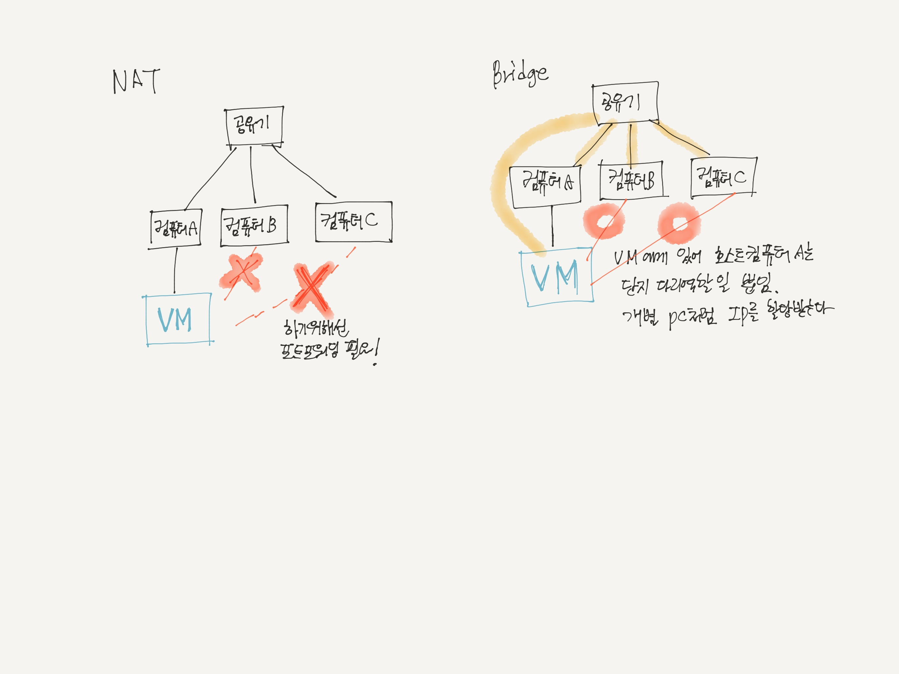

# NAT와 Bridge
VMware 설치시 NAT와 Bridge 중 2가지의 네트워크 통신방법중 한가지를 선택해야했다. VMware 기반에서는 IP를 주소를 누가 Virual Machine 에게 주느냐에 따라 크게 2가지로 나뉜다. 두 네트워크 통신 방법이 어떻게 다른지 알아보자!

#### NAT (Network Address Transation)
* 호스트 컴퓨터가 VM 에게 IP를 주는 방식. 
* 호스트 컴퓨터와 VM은 통신이 가능하고 VM과 다른 컴퓨터가 통신하고자 할 때는 포트포워딩 해주면 된다.

#### Bridge
* 라우터가 VM에게 IP를 주는 방식.
* VM에게 호스트컴퓨터는 다리역할을 할 뿐 라우터는 VM을  보기때문에 하나의 PC로 보기때문에 호스트컴퓨터 뿐만아닌 다른 컴퓨터들과도 통신이 가능하다.

