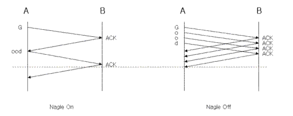

# 네이글 알고리즘(Nagle Algorithm)
네트워크 상에 패킷의 수를 줄이기 위해 개발된 알고리즘 

## 1. 일반 네트워크 통신 방법
일반적인 통신알고리즘은 데이터는 패킷으로 만들어 보낸다는 것이며 수신 호스트는 이에대한 ACK를 보낸다는 것입니다. 예를 들어, A,B 두 호스트가 통신을 합니다. A는 B에게 'Nagle'라는 데이터를 보내기 원하면, 먼저 'N'이라는 데이터를 패킷으로 만들어 출력버퍼로 보냅니다. 그리고 ACK를 받고 안받고 관계없이 'a'를 패킷으로 만들어 보내고 이어서 'g', 'l', 'e' 각 데이터를 패킷으로 만들어 보낼 것입니다. 
수신 호스트로 부터의 ACK가 언제 오는가와 상관없이, 언제 오든지 오기만 하면 되는 것입니다.

## 2. Nagle 알고리즘
네트웍에서 Nagle 알고리즘은 "가능하면 조금씩 여러 번 보내지 말고 한번에 많이 보내라(Effective TCP)" 라는 원칙을 기반으로 만들어진 알고리즘입니다.

Nagle 알고리즘의 원리는 ACK를 받은 다음에 데이터를 보내고 ACK를 받을 때까지 출력버퍼의 데이터를 저장하였다가 ACK를 받으면 버퍼의 데이터를 모두 패킷으로 만들어 보낸다는 것입니다. 예를 들어 A가 'N'이라는 데이터를 패킷으로 만들어 보내고, 계속해서 다음 데이터를 보내는 것이 아니라 출력버퍼로 보내어 저장시켜 둡니다. 그러다가 ACK가 오면 출력버퍼에 저장된 'agle'라는 데이터를 보냅니다.



TCP 소켓은 Default로 Nagle 알고리즘을 적용하고 있습니다.

## 3. Nagle 알고리즘의 장단점
* 장점 : 네트워크의 효율성이 높아짐. (똑같은 데이터를 보내더라도 생산하는 패킷이 적음)

* 단점 : 송신 호스트가 ACK를 받을 때까지 기다려야 하므로 전송 속도가 느려짐

## 4. Nagle 알고리즘의 중단
몇몇 네트웍 관련 프로그램에서는 네트웍의 전송량이나 부하보다는 빠른 응답속도를 더 중요시 여기는 상황이 있습니다. 그러한 때에는 TCP_NODELAY  라는 옵션을 사용하여 Nagle 알고리즘을 제거 할 수 있습니다.

### TCP_NODELAY 옵션
* 1(TRUE) : Nagle 알고리즘을 적용하지 않습니다.
* 2(FALSE): Nagle 알고리즘을 적용합니다.

``` c
int opt_val = TRUE;

setsockopt(sock, IPPROTO_TCP, TCP_NODELAY, &opt_val, sizeof(opt_val));
```

해당 옵션의 사용은 네트웍 부하를 극대화 시켜주면서 서버의 전체적인 성능을 무척 감소하기때문에 꼭 필요한 경우에만 매우 주의를 해서 사용해야 합니다.

- 전송은 작은 단위로 자주 이루어지지만 즉각적인 응답은 필요 없는 어플리케이션에서만 사용 되어야 합니다.(마우스 움직임 같은)

Nagle 알고리즘은 리얼타임시스템에서의 제어와 특히나 인터렉티브한 키 입력을 하는 어플리케이션에서는 안 좋은 영향을 미칩니다. 선택적으로 Nagle 알고리즘을 통과하는 한가지 방법은 Out-of-bind 메시지 시스템을 쓰는 것입니다. 그러나 이것은 내용물에 제약이 있고 또 다른 문제(순서의 상실: loss of sequentiality)를 일으킬 수 있습니다.

[출처](http://egloos.zum.com/depiness/v/772710)
