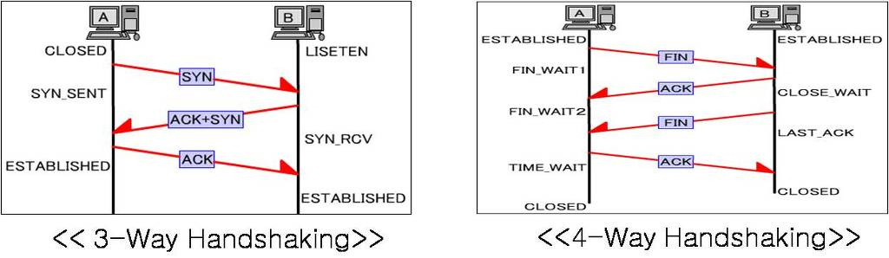

# Three way handshaking

TCP는 장치들 사이에 논리적인 접속을 성립하기 위하여 Three-way handshake를 사용한다.
(+ 주고받는 데이터의 동기성을 보장하기 위하여 사용)

TCP 3 Way Handshake는 TCP/IP 프로토콜을 이용해서 통신을 하는 응용프로그램이 데이터를 전송하기 전에 먼저 정확한 전송을 보장하기 위해 상대방 컴퓨터와 사전에 세션을 수립하는 과정을 의미한다.
 

Client --> Server : TCP / SYN
Client <-- Server : TCP / SYN / ACK
Client --> Server : TCP / ACK

여기서 SYN은 synchronize sequence numbers 그리고, ACK는 acknowledgement의 약자이다.
이러한 절차는 TCP 접속을 성공적으로 성립하기 위하여 반드시 필요하다.

## Three way handshake의 역할
서버와 클라이언트 양쪽 모두가 데이터를 전송할 준비됨을 보장하고, 또 실제로도 데이터 전달 시작 전 각각에게 상대방이 데이터를 송수신할 준비가 되었다는 것을 알 수 있게 한다.
양쪽 모두 상대편에 대한 초기 순차 일련번호를 얻을 수 있도록 한다.

## TCP의 Three way handshaking 과정
### STEP 1.
A 클라이언트는 B서버에 접속을 요청하는 SYN 패킷을 보낸다. 이때 A 클라이언트는 SYN을 보내고 SYN/ACK 응답을 기다리는 SYN_SENT 상태가 된.

### STEP 2.
B 서버는 SYN 요청을 받고 A클라이언트에게 요청을 수락한다는 ACK와 SYN flag가 설정된 패킷을 발송하고 A가 다시 ACK로 응답하기를 기다린다.
이때 B서버는 SYN_RECEIVED 상태가 된다.

### STEP 3.
A 클라이언트는 B 서버에게 ACK를 보내고 이후로부터는 연결이 이루어지고 데이터가 오가게 되는 것이다. 이때는 B 서버 상태가 ESTABLISHED이다. 
위와 같은 방식으로 통신하는 것이 신뢰성 있는 연결을 맺어준다는 TCP의 3 way handshaking 방식이다.

# Four way handshaking
3-Way handshaking은 TCP의 연결을 초기화 할 때 사용한다면, 4-Way handshake는 세션을 종료하기위해 수행되는 절차이다.

## Four way handshaking 과정
### STEP 1.
클라이언트가 연결을 종료하겠다는 FIN 플래그를 전송한다.

### STEP 2.
서버는 일단 확인메세지를 보내고 자신의 통신이 끝날때까지 기다리는데 이 상태가 TIME_WAIT 상태이다.

### STEP 3.
서버가 통신이 끝났으면 연결이 종료되었다고 클라이언트에게 FIN 플래그를 전송한다.

### STEP 4.
클라이언트는 확인했다는 메시지를 전송한다.

그런데 만약 Server 에서 FIN을 전송하기 전에 전송한 패킷이 Routing 지연이나 패킷 유실로 인한 재전송 등으로인해 FIN 패킷보다 늦게 도착하는 상황이 발행하게 된다면 어떻게 될까?

클라이언트에서 세션을 종료시킨 후 뒤늦게 도착하는 패킷이 있다면 이 패킷은 Drop 되고 데이터는 유실될 것이다.
이러한 현상을 대비하여 클라이언트는 서버로부터 FIN을 수신하더라도 일정시간(디폴트 240초) 동안 세션을 남겨놓고 잉여 패킷을 기다리는 과정을 거치게 되는데 이과정을 "TIME_WAIT" 이라고 한다.

[참고](http://mindnet.tistory.com/entry/%EB%84%A4%ED%8A%B8%EC%9B%8C%ED%81%AC-%EC%89%BD%EA%B2%8C-%EC%9D%B4%ED%95%B4%ED%95%98%EA%B8%B0-22%ED%8E%B8-TCP-3-WayHandshake-4-WayHandshake)
