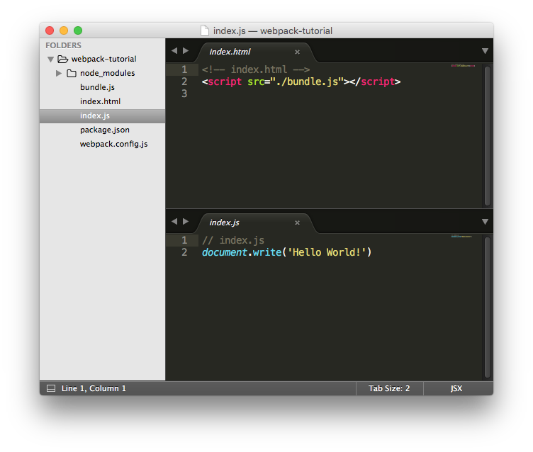

# Setup & Build Tools

리액트 앱들은 대부분 패키지매니저인 npm을 사용하여 Webpack 과 Babel으로 만들어집니다.
많은 다른 빌드툴들과 플러그인이 있지만, 세가지 가장 중요하고 공통적인 사항이 있습니다. create-react-app 또한 이것들을 사용합니다.

만약 당신이 자바스크립트 초심자이거나 만약 당신이 한동안 새 프로젝트를 시작하지 않은 경우이 중 일부는 익숙하지 않을 수 있습니다. 
그런 모두를 위해 무엇을 할지, 그것이 왜 필요한지, 그리고 어떻게 사용하는지 까지 다루겠습니다.

만약 당신이 새로운 프로젝트를 저희가 추천한 create-react-app으로 만든다면, 당신은 Webpack이나 Babel을 설치할 필요가 없습니다.
그러나 그것들은 여전히 하이레벨 관점에서 이해하기에 가치가 있습니다. 그래서 당신이 이번섹션에서 한번 훓고 지나가길 추천합니다.

시작해볼까요?

## npm
npm은 실행환경의 서버사이드 자바스크립트 실행환경인 node.js의 패키지 매니저입니다. 대부분의 리액트 앱들은 리액트 라이브러리와 3rd party libraries와 확장들을 npm 패키지를 통하여 로드합니다.

만약 당신이 자바스크립트 초보개발자거나 오래된 라이브러리들(e.g. jQuery, Backbone)을 사용한다면, 당신은 클라이언트 사이드 개발에서 npm을 사용할 필요가 없습니다. npm이 원래 node.js의 서버사이드 코드에서만 사용되도록 의도된것이지만 현재는 클라이언트 사이드 코드에서도 많이 사용됩니다. Webpack이 그것을 가능하게 만들었죠.

npm을 설치하는 데는 두가지 방법이 있습니다. npm을 포함하는 node.js를 설치하거나 다양한 버전의 node와 npm을 관리하도록 도와주는 nvm을 설치하는 것입니다. 만약 취미삼아 리액트를 조금만 다뤄볼 예정이라면 node.js 공식 웹사이트에서 node.js를 설치하는 것이 가장 쉽습니다.
만약 당신이 리액트를 크고, 중요한 프로젝트에 사용할 계획이라면 nvm을 사용하는 것이 좋습니다. 왜냐햐면 몇몇 사항에서 당신은 버전 업그레이드를 원할 것이기 때문이죠.

## npm 설치
### Option 1. node.js사이트에서 설치
node.js/npm을 [여기](https://nodejs.org/en/)에서 설치할 수 있습니다. 이것이 가장 쉬운 방법입니다.

### Option 2. nvm을 통하여 설치
[여기](https://github.com/creationix/nvm)에서 nvm 설치 방법을 볼 수 있습니다. 처음에는 조금 어려워 보이지만 리액트를 개발함에 있어 많은 가치가 있을겁니다. 당신의 플랫폼 과 쉘이 이것을 지원하는지 다시한번 체크해보세요. (윈도우에서는 공식적으로 지원되지는 않습니다.)
nvm은 단지 버전만 관리하기 때문에 nvm을 설치한 후에도 node 최신버전을 설치하는 것이 필요합니다. :

``` shell 
nvm install node
```

그리고 사용할 노드의 버전을 설정해주세요.

``` shell
nvm use node
```

이것을 비롯한 많은 설치 지침들이 링크에 있습니다.

### Option 3. package manager를 통한 설치 (Homebrew, etc)
node나 nvm은 별다른 어려움 없이 패키지 매니저를 통하여도 설치할 수 있습니다. 만약 당신이 이미 패키지 매니저를 사용하고있다면 이 방법을 가장 먼저 사용하세요. 모든 방법이 다 실패하게되면 node.js 사이트에서 바이너리로 실행해보세요. 이것은 거의 실행된다고 보장합니다.

## Basic
npm은 package.json 이라는 파일에 당신의 앱에 어떤 패키지가 의존성을 갖는지를 기록합니다. 이 파일은 리액트 프로젝트의 가장 상위 디렉토리에 존재해야만 합니다.
package.json 파일을 추가하기위해 가장먼저 :

``` shell
npm init
```

을 해줍니다.

이렇게 하면 커맨드 라인 프롬프트에서 앱에 대한 기본 세부정보를 추가할 수 있습니다. 세부사항은 옵션 사항이니까 프롬프트가 끝날때 까지 자유롭게 엔터를 눌러주세요. 

``` shell
npm install
``` 
을 실행하게되면 npm은 자동적으로 node_modules 라 부르는 폴더에 모든 의존성이 다운로드됩니다. 이 폴더는 package.json 파일과 나란히 위치하게 됩니다.

git에 커밋시에 프로젝트를 실행시 동일패키지 사용을 위해 package.json 파일을 보통 커밋하는게 보통이지만, node_modules 폴더는 함께 포함하지 않는 것이 보통입니다. 왜냐하면 크기가 크고 package.json에 작성된 의존 리스트를 바탕으로 다운받을 수 있기 때문이죠.

foo-bar 라는 패키지를 설치 및 package.json 파일에 추가하기위해서는, 아래 코드를 실행하세요 :

``` shell
npm install --save foo-bar
```

> 만약 node 버전 5를 사용하고있다면, --save 를 안붙여도 됩니다. v5이전에는 package.json에 의존성을 추가하려면 --save를 붙이는것이 필수였습니다. 그렇지 않으면 패키지는 인스톨 될지 몰라도 의존성 추가는 되지 않습니다. v5에서는 --save가 디폴트로 들어갑니다.
> 또한, 노드 v5를 사용한다면 의존성을 설치할때, package-lock.json파일이 자동적으로 생성됩니다. 이 파일은 의존성의 정확한 버전을 lock해둠으로써 올바른 버전 실행을 보장합니다. 이 파일은 꼭 git에 commit 되어야 합니다.


## Webpack
Webpack은 클라이언트 사이드 코드를 하나의 자바스크립트 파일로 묶어줍니다. Webpack은 플러그인으로 구성이가능하여 거의 모든 asset들을 하나로 묶을 수 있습니다.
Webpack은 거대한 토픽이며, 공식적인 도큐멘테이션은 작성중에 있습니다. 이것은 문제가 발생할 가능성이있고, 관련된 문제는 스택오버플로우나 git을 보면서 문제를 검색해야합니다. 지금은 꽤 정상적이므로 문제해결을 위해 너무 낙담하진 마세요.
Webpack의 도뷰멘트는 [여기](https://webpack.js.org/)에서 볼 수 있으며, Webpack의 [overview](https://webpack.js.org/concepts/) 또한 훌륭합니다.

> Note: 만약 간단한 리액트 셋업을 찾고있다면 Webpack을 설치할 필요가 없습니다. 대신에 create-react-app을 사용하면됩니다. 수동으로 설치하고 구성패야하는 Webpack은 당신의 stack을 좀더 유연하게 컨트롤 할 수 있습니다. 그러나 리액트를 처음 시작할때엔 필수는 아닙니다.

# How it works
webpack을 엔트리파일(자바스크립트에서의 index.js)을 제공할때, webpack은 파일을 분석하고 이 파일이 require(node.js 에서 다른 파일을 포함하기위한 API)를 통하여 파일이 의존하고 있는 것을 결정합니다. 이것은 명백하게 모든 필요한 파일을 하나의 파일로 연결시켜줍니다.  

Webpack은 우리가 클라이언트 사이드 개발시에 npm packages를 사용하도록 합니다.
* 당신의 파일 시스템을 읽고, require를 부르는 것을 읽고, 모든 필요한 자바스크립트 파일을 하나의 자바스크립트 파일로 묶습니다. 이 하나의 자바스크립트 파일은 웹에서 사용됩니다.
* 두 환경에서 코드를 실행할 수 있도록 node API를 벗깁니다.

# Minimal setup
webpack 미니멀 셋업을 살펴봅시다. 우리는 리액트를 아직 추가하지 않았습니다. 왜냐하면 복잡성을 추가하기전에 webpack을 이해하는것이 중요하기 때문입니다. 
자유롭게 이것을 읽고 따라오거나 혹은 이 조각들이 어떻게 함꼐 맞춰지는지 읽어보세요. 만약 따라오기로 결정했다면 새로운 디렉토리아래 npm init을 실행하시고 빈 package.json파일을 얻으세요. 끝난 프로젝트는 [dabbott/webpack-tutorial](https://github.com/dabbott/webpack-tutorial) 에서 레퍼런스로 사용할 수 있습니다.

## 설치
package.json 파일과 동일 디렉토리에 있다고 가정했을때, 우리는 webpack과 개발 서버를 아래와 같은 명령으로 추가할 수 있습니다.:

```shell
npm install --save-dev webpack wepack-dev-server
```

이 명령은 webpack과 개발 서버를 dev dependency에 추가합니다. 다시말해서 이것은 의미합니다: webpack은 개발하는 동안 프로젝트 빌드를 위해 필요하지만 프로젝트가 프로덕션 용으로 이미 빌드되거나 프로젝트를 라이브러리로 사용하는 경우에는 필요하지 않습니다.

## 스크립트
우리는 package.json 파일의 스트립트 섹션에  두 가지 스크립트를 추가합니다. :

``` javascript
{
	"scripts" {
		"dev": "webpack-dev-server --env.dev",
		"build": "webpack"
	}
}
```

dev script는 우리의 개발 서버를 실행시켜주고, {env: 'dev'} 옵션을 넘겨줍니다. build 스크립트는 프로덕션 서버에서 제공하기위해 단일 .js 파일로 파일시스템에 저장됩니다.

## Configuration
Webpack은 분리된 config 파일을 사용하여 설정됩니다. : webpack.config.js
이 파일은 configuration 오브젝트를 혹은 configuration object를 리턴하는 함수를 export를 해야합니다. webpack.config.js를 추가합시다.

``` javscript
module.exports = options => {
	return {
		entry: './index.js',
		output: {
			filename: 'bundle.js',
		},
	}
}
```

여기에는 두개의 필수 필드가 있습니다. :  엔트리 포인트 파일과 아웃풋 파일입니다. 후에 우리는 개발과 프로덕션에 따라 다른 configration을 적용할 수 있읍니다.(기억해보세요. dev 스크립트에서 옵션으로서 {env: 'dev'} 을 전달했다는 것을요)


## 필수 파일들
화면에서 보기위해 필요한 최소한의 파일을 만들어봅시다. 우리는 index.js 파일과 index.html 파일을 만듭니다. :

``` javascript
// index.js
document.write('Hello World!')
```

``` html
<!-- index.html -->
<script src="./bundle.js"></script>
```

## 개발서버에서 실행
이제 우리는 npm run dev를 실행합니다. 우리가 package.json에서 셋업했던 스크립트를 실행하기 위해서 말입니다.
이것은 development 서버를 실행할 겁니다. 만약 브라우저에서 localhost:8080 를 찾아간다면, 우리의 index.html 파일을 볼 수 있습니다. 이 파일은 스크린에 Hello world!를 화면에 띄우면서 bundle.js로 묶인 index.js 를 실행합니다.

bundle.js 파일은 development server에 의해 메모리에서 제공됩니다. 
프로덕션 빌드의 경우 npm run build를 사용하여 최적화 된 bundle.js를 빌드하여 파일 시스템에 저장해야합니다.
레퍼런스를 위해 우리의 디렉토리는 이렇게 보입니다.


## 이게 다입니다!
기본적인 webpack 빌드를 위해 셋업 단계가 필요했습니다. 많은 다른 플러그인들과 configuration 옵션들이 배울 가치가 있습니다. 다음 섹션에서 우리 코드를 transpilign 해줄 babel 플러그인과 react 라이브러리를 설치하겠습니다.

## Babel
Babel은 

