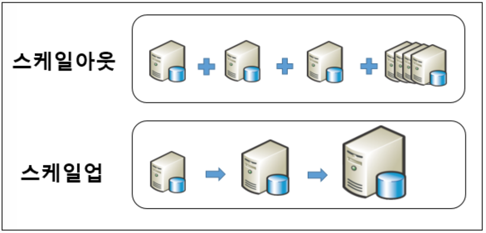

#Scale Up / Scale Out

#### Scale Up
* 각 단일 서버(하드웨어)의 성능을 증가시켜서 더 많은 요청을 처리하는 방법을 스케일 업이라고 한다.
	-> 하드웨어 증가 
* Scale Up은 기존 사용하는 장비의 업그레이드이기 때문에, 기존 장비 사양에 따라 증설 계획이 결정된다. 하지만, 일반적으로 데이터베이스 장비는 구매 당시, 시스템 안정성을 고려하여 가장 우수한 성능의 시스템으로 구매한다. 이러한 장비를 다시 고 사양으로 업그레이드 한다는 것은 장비 하나를 더 추가하는 것보다 비싼 댓가를 치르게 된다. 
* 수직 스케일

#### Scale Out
* 동일한 사양의 새로운 서버(하드웨어)를 추가하는 방법을 스케일 아웃이라고 한다.
* 수평 스케일

#### 스케일 아웃(Scale out)과 스케일 업(Scale up) 비교
/  | 스케일 아웃(Scale out) | 스케일 업(Scale up)
---|------------------------|-------------------------
확장성| 하나의 장비에서 처리하던 일을 여러 장비에 나눠서 처리할 수 있도록 설계를 변경하는 것. 수평 확장. 지속적 확장이 가능 | 더 빠른 속도의 CPU로 변경하거나, 더 많은 RAM을 추가하는 등의 하드웨어 장비의 성능을 높이는 것. 수직 확장. 성능 확장에 한계가 있음
서버비용 | 비교적 저렴한 서버를 사용하므로 일반적으로 비용 부담이 적음 | 성능 증가에 따른 비용 증가폭이 크며, 일반적으로 비용 부담이 큼 
운영비용 | 대수가 늘어날수록 관리 편의성이 떨어지며, 서버의 상면 비용*을 포함한 운영 비용이 증가함 | 관리 편의성이나 운영 비용은 스케일 업에 따라 큰 변화 없음 
장애 | 읽기/쓰기가 여러대의 서버에 분산되어 처리됨으로 장애 시 전면 장애의 가능성이 적음 | 한대의 서버에 부하가 집중되므로 장애시 장애 영향도가 큼.

* 서버호스팅이란 IDC와같은 전용공간에 서버를 임점시켜서 서비스를 받는 것이다. 이 경우 IDC에 서버를 적재할 수 있는 공간을 할당받음으로서 발생하는 비용이 상면요금이고, 적재된 서버를 외부와의 통신이 가능하게끔 인터넷 서비스를 제공하는것이 회선요금이다.

	* IDC (Internet Data Center): 인터넷 검색, 쇼핑, 게임, 교육 등 방대한 정보를 저장하고 웹 사이트에 표시하기 위해 수천, 수만 대의 서버 컴퓨터가 필요하게 되자, 이 서버 컴퓨터를 한 장소에 모아 안정적으로 관리하기 위한 목적으로 만든것.
	* 클라우드 데이터 센터(Cloud Data Center) : 클라우드를 위한 데이터 센터

