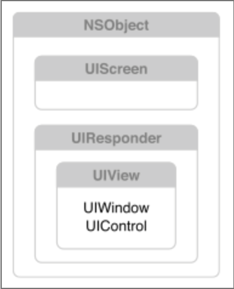
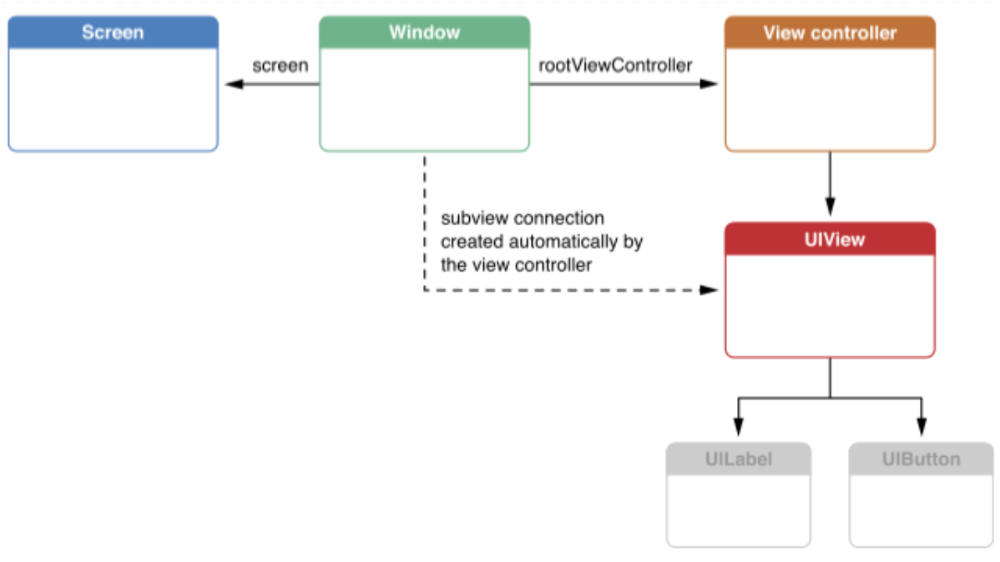
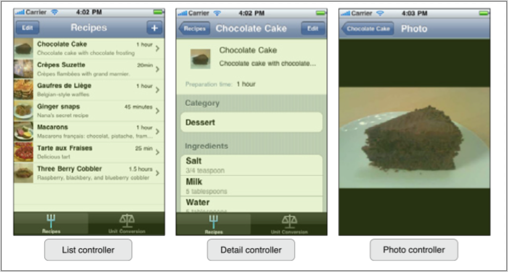
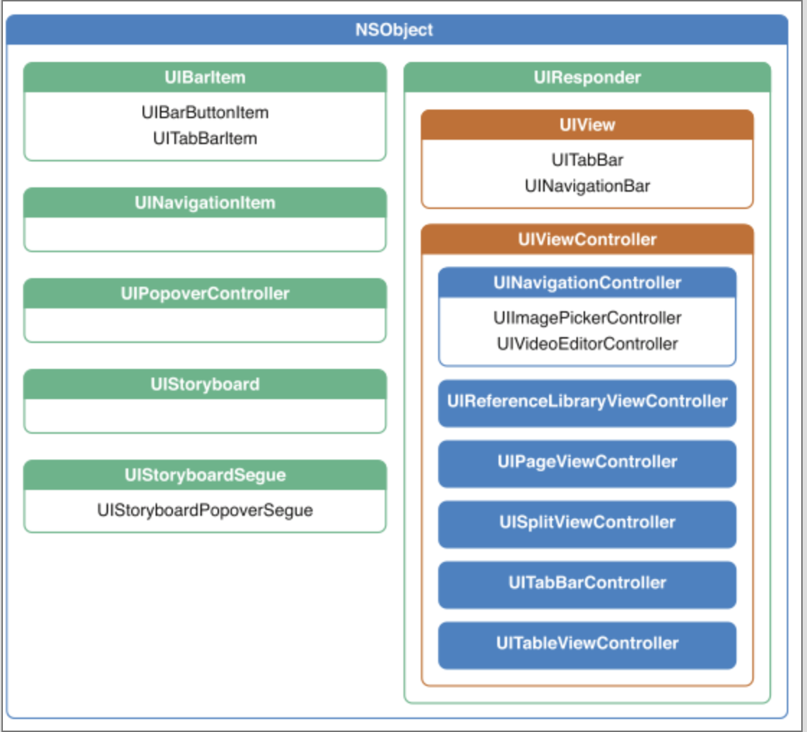

# View Controller

> View controllers are an important part of managing your application’s views. A view controller presides over all of the views in a single view hierarchy and facilitates the presentation of those views on the screen. 
뷰 컨트롤러는 당신의 어플리케이션의 뷰를 관리하는 매우 중요한 부분입니다. 뷰 컨트롤러는 뷰 컨트롤러는 단일 뷰 계층 구조의 모든 뷰를 관리하고 화면에서 이러한 뷰의 프리젠테이션을 용이하게합니다.

## View Controller의 개념
ViewController 는 앱의 데이터와 UI간의 중요한 연결고리 역할. iOS앱이 UI를 표시할 때, 표시된 컨텐츠는 모두 1개 이상 ViewController 에 의해 관리되거나 여러 ViewController 그룹들간 상호 작용을 통해 관리된다.

전통적인 MView Controller 디자인에서 컨트롤러 역할 뿐 아니라 더 많은 작업을 iOS에서는 수행(화면회전등에 대한 표준 구현…)

## View Controller 기초
iOS 장치들은 화면이 작아 많은 양의 데이터를 표시할 때 조금씩 여러단계에 걸쳐서 나누어 표시. ViewController 는 데이터를 표시 하고 숨기는 작업 을 조율하고 그 내용을 관리 하는 인프라를 제공.

### Screen, Windows, 그리고 Views 가 시각적 인터페이스를 생성
* UIScreen 객체 : 장치에 연결된 물리적 스크린
* UIWindow 객체 : 스크린상에 그리기 기능을 제공
* 일련의 UIView 객체들 : 윈도우가 요청하면 각각 자신의 영역에 그림을 그림.

* 뷰 시스템
View 는 다음과 같은 특징을 가짐.

1. UI요소(특정영역을 점유하면서 컨텐츠를 사용자에게 표시하고 사용자 이벤트에 반응).
2. View계층을 구성. (부모-자식 관계)
3. 속성 애니메이션을 구현.
4. 앱 내에서 로직을 수행하지는 않음. UIButton 처럼 단순히 클릭했다는 사실만을 인식하고 그에 맞는 화면표시만 담당.

## ViewController 는 View들을 관리
View 및 기타 리소스들을 관리하는 역할.
윈도우의 rootViewController 속성을 설정하면, 윈도우의 서브뷰로서 해당 ViewController 의 뷰 계층이 들어간다.

ViewController 는 필요할때가 되어야 View 를 로딩함. 특정상황에서는 View 의 리소스를 해제하기도 하므로, 앱내에서 리소스 관리에 있어 중요한 역할을 함.

ViewController 는 연결된 뷰들의 연계 동작을 구현하는 곳. View 는 “버튼이 눌림”이 실제 어떤 작업으로 연결되는지 몰라도, ViewController 는 알 수 있다.

ViewController 는 앱의 전체 데이터 중 일부만을 화면에 표시하는 경우가 대부분. 독립적으로 데이터를 나누어 맡아 처리하므로, ViewController 간 연계도 필요하다.

## Recipe 앱 예제

ViewController 의 공통점이 드러나는 예제.

모든 View는 오직 하나의 ViewController 에 의해 제어됨. UIViewController 의 view 속성을 통해 소유됨. view 가 subview 라면, 소유하는 ViewController 에 의해서 제어될 수 도, 아닐 수도 있음.
모든 ViewController 는 데이터의 전체가 아닌 부분만을 다룬다.
위 2) 와 같이 되어 있으므로, 결국, ViewController 끼리는 서로 협력을 해야만 전체 데이터를 관리할 수 있다.

## ViewController 의 분류
아래 그림은 UIKit 프레임웍의 ViewController 과 관련한 주요 클래스들을 표시.

크게 2가지로 나뉜다.

### Content ViewController
다음의 역할을 담당

1. 데이터를 사용자에게 표시
2. 사용자로 부터 데이터를 수집
3. 특정 작업을 수행
4. 게임 시작 옵션과 같은 일련의 명령/옵션을 선택

#### UITableViewController 예.
UITableViewController 는 view 속성 외에도 tableView 속성을 가지고 table view를 소유/제어

### Cotainer ViewController
다른 ViewController 에 의해 소유되는 컨텐츠를 포함. 다음과 같은 차이가 있음.

1. 자식을 다루기 위한 전용 API
2. 자식들간의 관계유무와 종류를 결정
3. 원래는 자식 ViewController 가 하는 view-subview 간 레이아웃 재배치등과 같은 것을 직접 함.

### UINavigationController 예
자식 ViewController 를 stack 기반 자료구조에 저장/관리(맨 아래쪽은 첫화면, 맨 위는 현재화면). 주로 자식 ViewController 만 관리하지만, 자신이 직접 챙기는 View 도 있다. (Bar Button)

### UITabBarController 예
tab 대화상자와 비슷.

### 기타

* UISplitViewController : 화면을 Master /Detail 로 나란히 배치하여 Master 에서 선택한 사항의 상세 내용을 Detail 쪽에 표시.
* UIPopoverController : portrait 모드에서 마스터 뷰가 표시할 수 있는 특별한 컨트롤. popover.
* UIPageViewController : 페이지 레이아웃을 구현. 책과 같은 UI 를 생성.

## ViewController 의 컨텐츠는 여러방법으로 표시
아래와 같은 방법으로 ViewController 의 컨텐츠가 사용자에게 보여짐.

1. 윈도우의 rootViewController 로 설정
2. Container ViewController 의 자식으로 설정
3. Popover 컨트롤에 표시
4. 다른 ViewController 로 부터 present
